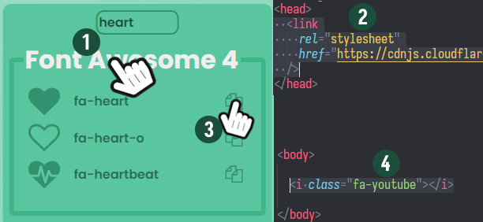

<h1 align="center">
   
  
   
  Quick HTML Icons
  <h4 align="center">A quick way of getting icons to your website</h4>
</h1>

  
  
  

## About

This project is a little handy website made for quickly getting some icons for your HTML page.

## How to use

1. Click on "Font Awesome 4" or "Google", it copies a `link` tag to your clipboard
2. Paste the link tag inside the head tag of your html
3. Click on the copy button of any icon you like, it copies the `i` tag of the icon
4. Paste it in your HTML

> **Note**
> Font Awesome 4 name their icons as of what they are (e.g. a heart icon is named "fa-heart"),
> but Google name their icons as of what they do (e.g. a heart icon is name "favorite").

## Where do the icons come from?

The icons are from Font Awesome 4 and Google. Neither needs to create an account or pay.
The links and references where copied from [this W3Schools page](https://www.w3schools.com/icons/icons_reference.asp).
